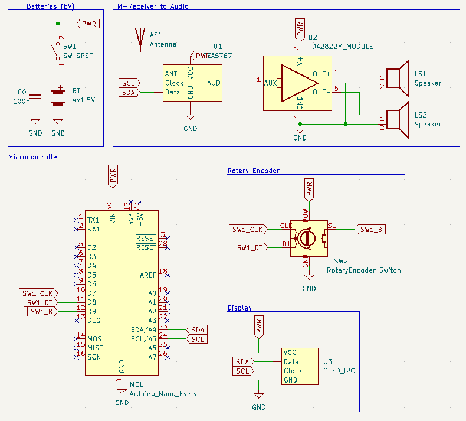

# Arduinoradio 

FM-radio receiver using arduino, audio amplifier and receiver module.

Project repository: https://github.com/mimimaki/Arduinoradio

## Hardware

* Arduino Nano Every
* TEA5767 FM-Radio Module
* 64x128 OLED Display Module
* Rotary encoder with push-button
* 2x 3W 4om Speakers
* LM386 Audio Amplifier Module
* Batteries

## Arduino code

The arduino code utilizes Adafruit_GFX and Adafruit_SSD1306 libraries to control the OLED screen and Wire to use I2C. The program is diveded to help functions, named accordingly to their task. Turning the rotary encoder switches the frequency, and pressing it returns it to 97.7MHz. The listened frequency will be displayed on the screen.

## Author
Written initially by Miikka Mäki (git: mimimaki), 4th October 2023. Documentation in github improved in 6th August 2024.
### [Miikka Mäki](https://github.com/mimimaki)

## License
MIT License, free to use as you wish. 
